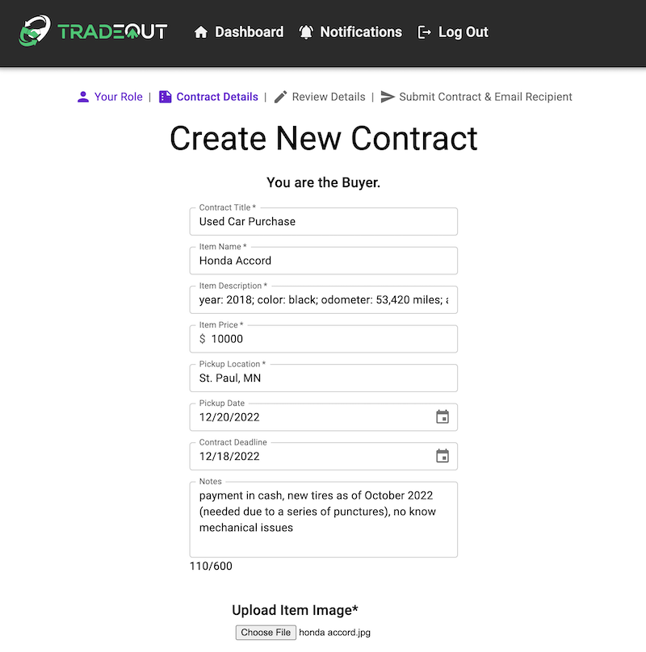
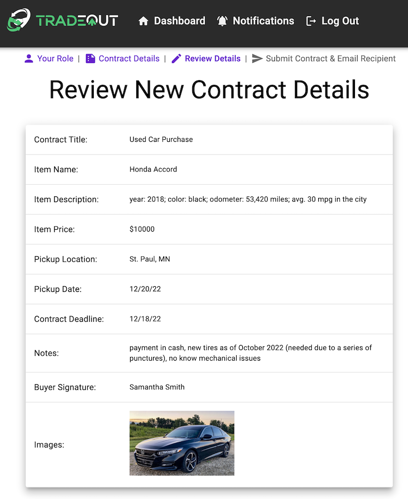
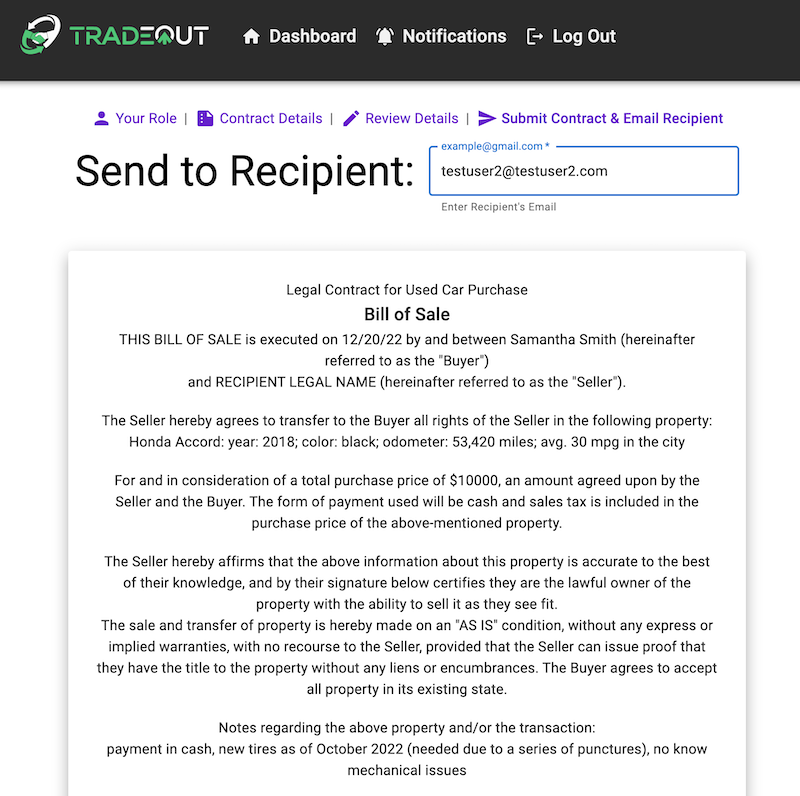
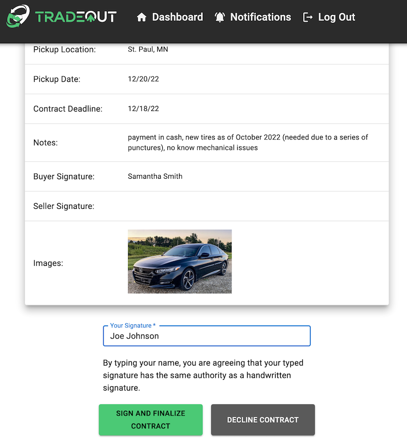
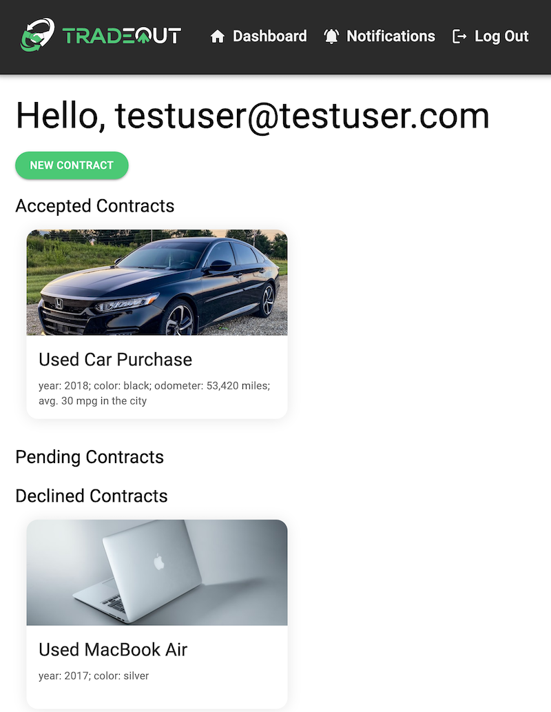
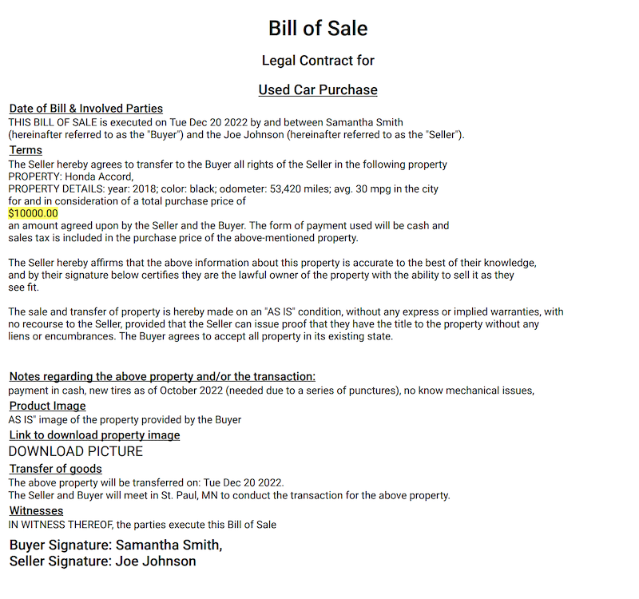

# TradeOut

## Description

Conducting transactions in an online marketplace can be risky, and, unfortunately, scams and falsely advertised products are quite common. TradeOut is a platform that gives people greater transaction security by providing a quick and simple way to generate a digital contract between buyer and seller. Whether you’re the buyer or the seller, in TradeOut you can:
- Initiate a contract for a transaction, including uploading item images
- Send the contract to the other party
- Sign the contract once you agree with the terms
- Always access a copy of the final, signed contract
- View all accepted, pending, and declined contracts

Check out the deployed app [here](https://tradeout.herokuapp.com/)! (Note: image upload has been disabled for the time being.)

## Screenshots
<h4 align="center">Create a Contract</h4>
<div align="center">
 
</div>

<h4 align="center">Review a New Contract</h4>
<div align="center">
 
</div>

<h4 align="center">Send a Contract to a Recipient</h4>
<div align="center">
 
</div>

<h4 align="center">Review a Contract as the Recipient</h4>
<div align="center">
 
</div>

<h4 align="center">User Dashboard</h4>
<div align="center">
 
</div>

<h4 align="center">View the PDF of an Accepted Contract</h4>
<div align="center">
 
</div>

## Prerequisites

- [Node.js](https://nodejs.org/en/)
- [PostrgeSQL](https://www.postgresql.org/)
- [Nodemon](https://nodemon.io/)
- [SendGrid](https://sendgrid.com)
- [AWS S3](https://aws.amazon.com/s3/)
- [PDFMake](http://pdfmake.org/#/)

## Installation

1. Create a new database named `tradeout`, and execute the queries from `database.sql` to create the needed tables. 
2. Within a code editor, open a terminal window and install the dependencies by running: `npm install`.
3. Create a `.env` file with values for the following variables:
  ```
  SERVER_SESSION_SECRET=random string containing more than eight characters

  SENDGRID_API_KEY=key provided with SendGrid account
  SENDGRID_EMAIL=verified sender email

  AWS_ACCESS_KEY_ID=access key id from AWS
  AWS_SECRET_ACCESS_KEY=secret access key from AWS
  AWS_REGION=your AWS region
  S3_BUCKET_NAME=your AWS S3 bucket name
  ```
4. Note: [This tutorial](https://www.youtube.com/watch?v=yGYeYJpRWPM) by Sam Meech-Ward can be referenced to create the S3 bucket with correct access levels.
5. Run `npm run server` to start the server in one terminal window. Open a second terminal window, and run `npm run client` to start the client. The application will open at `localhost:3000/#/dashboard` in the browser. TradeOut was tested and designed for compatibility with Google Chrome. 

## Usage

### Registering

1. To register as a new user, click `Register` and enter an email, legal name, and password. 

### Logging In

1. To log in, enter the email and password associated with the account and click `Log In`. 

### Creating a Contract

1. To create a contract, click `New Contract` from the Dashboard. Select `Buyer` or `Seller` and click `Next`.
2. Within Create New Contract, enter the required informaton in the fields marked with a `*` and any other relevant information. Click `Choose File` to upload an image of the item being purchased or sold. Type the signature in the signature field. Click `Review Contract` to proceed. 
3. Review the contract details. Make any changes by clicking `Edit Contract Details` or proceed by clicking `Recipient Contact Information`. 
4. Within Send To Recipient, enter the email address of the other party in the contract. Click `Generate Contract Token` to generate a unique key that the recipient will receive to be able to securely view the contract. 
5. Click `Create Contract and Send to Recipient` to send an email to the recipient letting them know a contract is pending. 

### Receiving a Contract

1. Click the link in the email sent from TradeOut to be taken to Recipient View. Recipient View shows the status of the contract. If pending, review the contract details and click `Accept` or `Decline`. (Note: Clicking `Decline` does not require an account.)
2. Clicking `Accept` requires an account and will navigate to Registration. Once registered, the contract appears in the Dashboard.

### Accepting or Declining a Contract

1. Clicking a contract card from the Dashboard shows its details. If a contract is pending and awaiting an action, a signature field and buttons will appear at the bottom of Contract Details. 
2. To accept the terms of a contract, type the signature in the signature field and click `Sign and Finalize Contract`. The contract will then appear under the Accepted heading in the Dashboard.
3. To decline a contract, click `Decline`. The contract will then appear under the Declined heading in the Dashboard.

### Accessing a PDF for an Accepted Contract

1. Click an accepted contract card from the Dashboard to view its details. 
2. Click the `View Contract PDF` button to access the finalized PDF of the contract.

## Built With

Node.js | Express.js | React.js | Redux | Redux-Saga | JavaScript | PostgreSQL | Passport | Material UI | SendGrid | AWS S3 | PDFMake 
